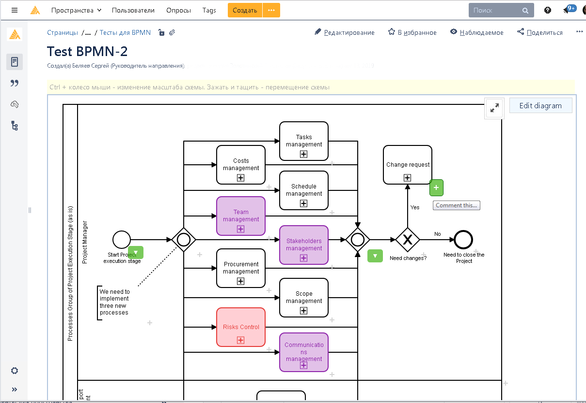
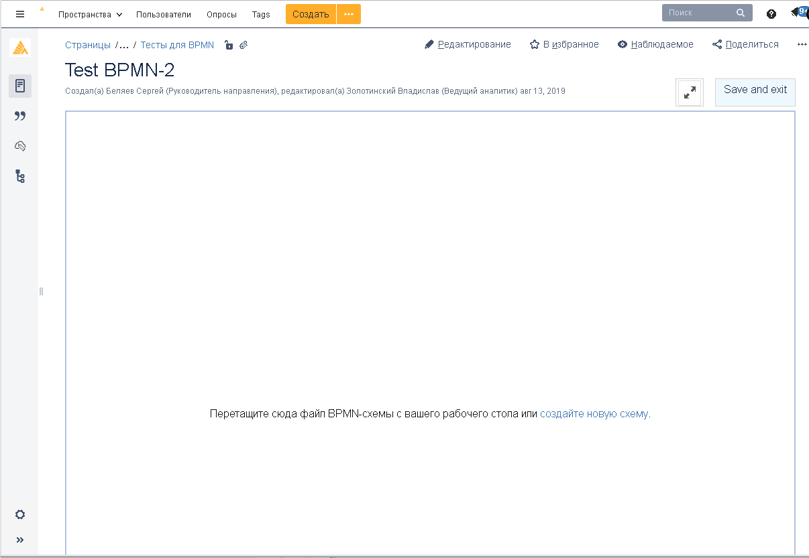

# confluence-bpmn
Confluence client-side plugin for working with BPMN diagrams

Hello everyone!
This is a simple project for embedding <a href="https://github.com/bpmn-io/bpmn-js">bpmn-js</a> in Atlassian Confluence. You can find very similar apps for Confluence <a href="https://marketplace.atlassian.com/apps/1215543/bpmn-modeler-free?hosting=server&tab=overview">here (free)</a> and <a href="https://marketplace.atlassian.com/apps/1219284/bpmn-modeler-enterprise?hosting=datacenter&tab=overview">here</a>. 
With this plugin you can easily create and edit BPMN diagrams on your Wiki-pages and use them with anything else you have in Confluence.
 

<h2>Features and abilities</h2>
1. Display interactive BPMN diagram at Confluence page  
2. Host BPMN-file as a page attachment.  
3. Edit diagram via browser  
4. Comment any diagram element  
5. Full-screen mode  
6. Mini-map for big diagram in edit mode  
7. Hot keys in edit mode (like Ctrl+z)  
8. Moving and zooming canvas  
9. Balloons on links and comments  

<h2>How to implement</h2>
1. In your Confluence, create special page for hosting source files. Get a pageId of this page. 
2. Add all files from <a href = "https://github.com/Serg-Belyaev/confluence-bpmn/tree/master/Sources">Source folder</a> to your page as attachments. 
Note: be sure that all users have read access to these files. 
3. Open in edit mode a page where you want to create BPMN diagram. 
- Add HTML macro (how to do: https://confluence.atlassian.com/doc/html-macro-38273085.html ). Pay attantion that HTML macros are disabled by default!  
- In HTML editor, add this code: 
 

<b>Code snippet</b>

&lt;div id=&quot;bpmn_zone&quot;&gt;&lt;/div&gt; 
&lt;script src=&quot;https://yourserver/download/attachments/122190480/confluence-bpmn.js &quot;&gt;&lt;/script&gt; 

<b>End code snippet</b>

Where:
-	https://yourserver/ - your Confluence server URL
-	122190480 – pageId of the page from step 1. 
Note: be sure that url https://yourserver/download/attachments/122190480/confluence-bpmn.js is accessible. 

Done!

Now save the page and you`ll see a special zone for creating BPMN diagram.

In addition, you can upload existing diagrams in bpmn format (files must have .bpmn extension).
Note: it is useful to create a special page template with embedded code snippet.

<h2>Create a link from diagram element</h2>
To create a link from any diagram element: 
- open it in edit mode 
- select an element 
- in properties panel open Extension tab 
- create new custom property with name "url" and required url-address as a value 
- save diagram 
 
P.S. Tested on Confluence version 6.8.1. If something doesn’t work, let me now in <a href = "https://github.com/Serg-Belyaev/confluence-bpmn/issues">Issues!</a>

